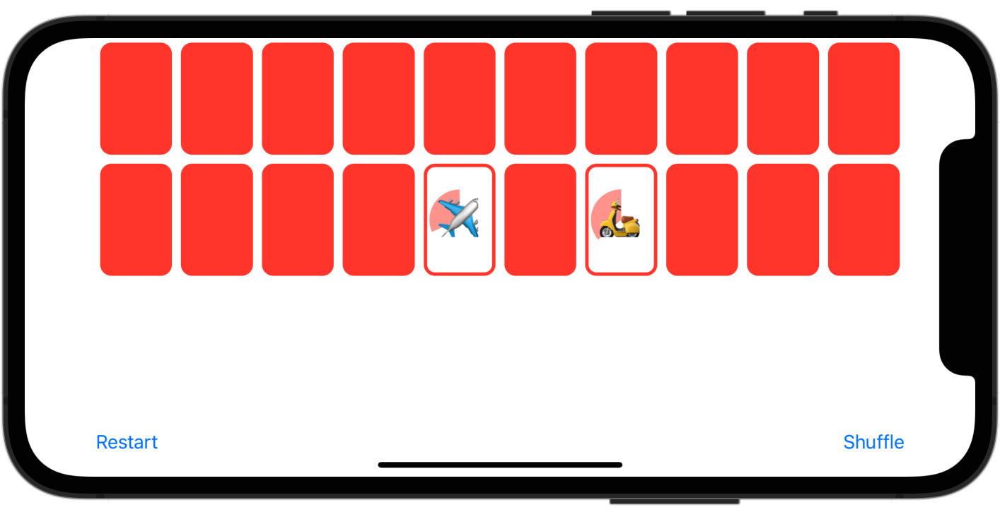
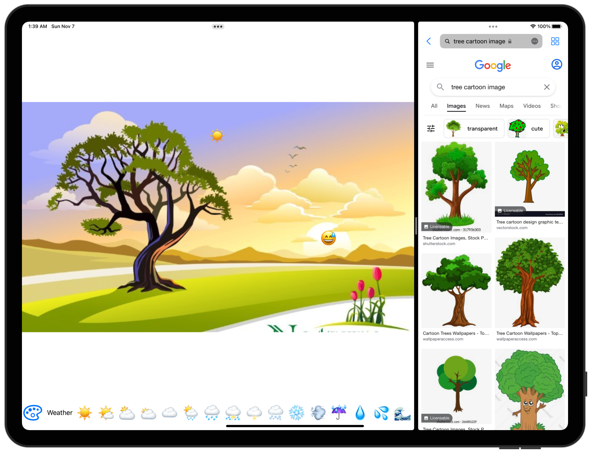

# Memorize Game:flower_playing_cards: & Emoji Art:art:

[](https://github.com/IcedOtaku/CS193p/stargazers)
[](https://github.com/IcedOtaku/CS193p/network)
[](https://github.com/IcedOtaku)

## Introduction
Demo app while learning [Stanford University's Course CS193p](https://www.youtube.com/playlist?list=PLpGHT1n4-mAsxuRxVPv7kj4-dQYoC3VVu), mainly engaged in Swift, SwiftUI and MVVM Architecture.

In `MemorizeApp.swift`, switching variable appMode between `MemorizeAppMode` and `EmojiArtAppMode` to load corresponding app.

```swift
@main
struct MemorizeApp: App {
    enum AppMode: Equatable {
        case MemorizeAppMode
        case EmojiArtAppMode
    }

    /// switch this mode to get in different app
    private let appMode:AppMode = .EmojiArtAppMode

    /// memorize vars
    private let game = MemoryGameViewModel()

    /// emojiart vars
    @StateObject var document = EmojiArtDocumentViewModel()
    @StateObject var paletteStore = PaletteStore(named: "Default")

    var body: some Scene {
        WindowGroup {
            if appMode == .MemorizeAppMode {
                MemoryGameView(viewModel: game)
                    .preferredColorScheme(.light)
            }
            if appMode == .EmojiArtAppMode {
                EmojiArtDocumentView(document: document)
                    .environmentObject(paletteStore)
            }
        }
    }
}
```

## Screenshots

* MemorizeApp

    

* EmojiArtApp

    

## Lectures

* Lecture 1: Getting started with SwiftUI
* Lecture 2: Learning more about SwiftUI
* Lecture 3: MVVM and the Swift type system
* Lecture 4: Memorize Game Logic
* Lecture 5: Properties Layout @ViewBuilder
* Lecture 6: Protocols Shapes
* Lecture 7: ViewModifier Animation
* Lecture 8: Animation Demonstration
* Lecture 9: EmojiArt Drag and Drop Multithreading
* Lecture 10: Multithreading Demo Gestures
* Lecture 11: Error Handling Persistence
* Lecture 12: Bindings Sheet Navigation EditMode
* Lecture 13: Publisher More Persistence
* Lecture 14: Document Architecture
* Lecture 15: UIKit Integration
* Lecture 16: Multiplatform (macOS + iOS)

## Requirements

* iOS 15.0
* Xcode 12.0
* Swift 5.4


